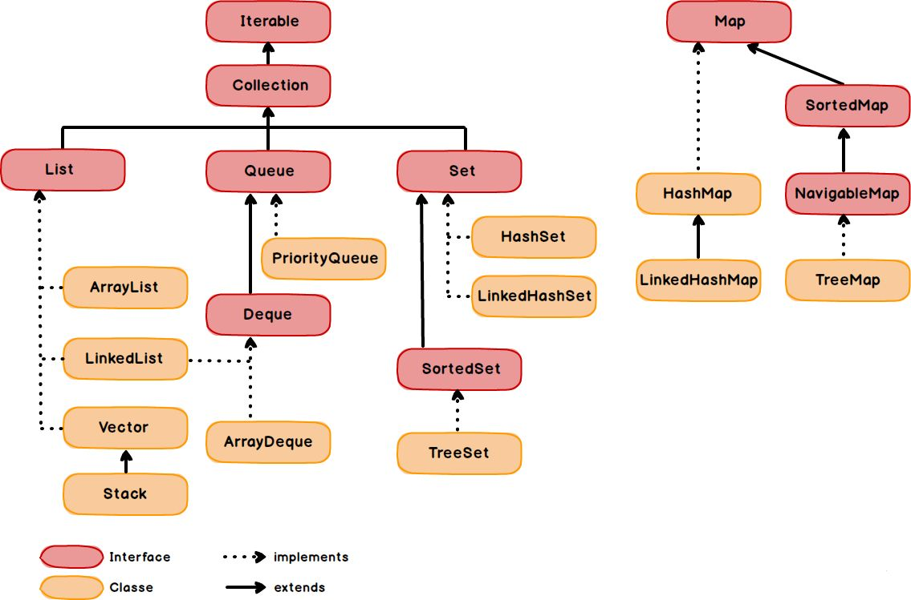

# Java Collection Framework

Коллекции в Java - различные структуры данных,
своего рода контейнеры для хранения данных и
манипулирования ими. Коллекции имеют все необходимые
методы для работы с данными, которые в них содержаться.



## List
List - упорядоченная последовательность элементов,
позволяющая хранить дубликаты и null. Каждый элемент
имеет индекс.

### ArrayList
ArrayList - расширяемый массив. В основе лежит массив Object.

`ArrayList<String> list = new ArrayList<>();` - создается массив
размером 10. `size = 0`, поскольку ни одного элемента пока не было добавлено.
`capacity = 10` это вместимость - размер массива.
Когда массив заполнится, то создастся новый массив большего размера,
элемента из старого массива скопируются и добавится новый.
Поэтому если заранее извествестно сколько будет эелментов в массиве, то
можно можно создать лист следующим образом- `ArrayList<String> list1 = new ArrayList<>(200);`
Создание листа с внутренним массивом, который имеет начальный размер на 200 эелментов

Пример инициализации:

[ArrayListInitializationExample](src/main/java/_2_arraylist/_1_arraylist_creating_and_methods/ArrayListInitializationExample.java)

Методы:

1) [ArrayListMethodsExample](src/main/java/_2_arraylist/_2_arraylist_methods/example_1_arlist_methods/ArrayListMethodsExample.java)
2) [ArrayListMethodsExample2](src/main/java/_2_arraylist/_2_arraylist_methods/example_2_arlist_methods/ArrayListMethodsExample2.java)
3) [ArrayListMethodsExample3](src/main/java/_2_arraylist/_2_arraylist_methods/example_2_arlist_methods/ArrayListMethodsExample3.java)
4) [ArrayListMethodsExample4](src/main/java/_2_arraylist/_2_arraylist_methods/example_2_arlist_methods/ArrayListMethodsExample4.java)

### LinkedList 
LinkedList - связанный список. Это цепочка данных. Каждое звено хранит данные,
а также ссылки на предыдущее и следующее звено.
Звено у которого нет предыдущего звена - голова,
Звено у которого нет следущего звена - хвост.

Каждое звено знает только о своих соседях -
предыдущем и последующем звене.

Чтобы найти какой-либо элемент, например, где-нибудь
по середине, нам нужно обходить связанный список, либо
с головы, либо с хвоста, обходить каждое звено,
пока не найдем нужный элемент.

Пример:

[LinkedListExample1](src/main/java/_4_linkedlist/_1_linkedlist_example/LinkedListExample1.java)

### Iterator

Iterator - предоставляет способ перебора элементов коллекции последовательно, один за дургим.
С его помощью можно не только получить элемент из коллекции, но также и удалить его.

Пример:

[IteratorExample](src/main/java/_3_iterator/IteratorExample.java)


### ListIterator

ListIterator - рассширяет возможности обычного Iterator. Он позволяет перемещаться по коллекции не только вперед
(от первого элемента в коллекции к последнему), но и назад

Пример:

[ListIteratorExample](src/main/java/_5_listiterator/ListIteratorExample.java)

Методы:

Эти методы имеются у Iterator & ListIterator:
1) `boolean hasNext()` - проверяет, имеется ли в списке следующий элемент
2) `E next()` - возвращает следующий элемент из списка
3) `void remove()` - удаляет последний возвращенный элемент из списка

методы, присущие только ListIterator:
4) `boolean hasPrevious()` - проверяет, есть ли предыидущий элемент в списке
5) `E previous()` - возвращает предыдущий элемент из списка
6) `int nextIndex()` - возвращает индекс элемента, который будет возвращен вызовом `next()`
7) `int previousIndex()` - возвращает индекс элемента, который будет возвращен методом `previous()`
8) `void set(E e)` - заменяет последний возвращенный элемент 
9) `void add(E e)` - добавляет новый элемент перед текущей позицией итератора


# Collections
Collections - утилитный класс. Он предоставлят множество статических методов для работы с коллекциями

Примеры использования методов класса Collections:
1) [CollectionsMethodsExample](src/main/java/_6_collections_util_class_methods/CollectionsMethodsExample.java)
2) [CollectionsMethodsExample2](src/main/java/_6_collections_util_class_methods/CollectionsMethodsExample2.java)

### Vector

Vector - устревший синхронизированный класс,
(ArrayList, LinkedList не синхронизированы)
в основе содержит массив Object

Пример:

[VectorExample](src/main/java/_7_vector/VectorExample.java)

### Stack
Stack - устаревший синхронизированный класс,
использует принцип LIFO

Пример:

[StackExample](src/main/java/_8_stack/StackExample.java)

# Map


### HashMap
HashMap - элементами являются пары ключ-значение. Порядок добавления не запоминается.

`Map<K,V> map = new HashMap<>();` - пример создания хешмапы

Ключи - должны быть уникальны. Ключ может быть `null`.
Значения могут быть одинаковы и `null`.

Если мы вставляем элемент с ключом, который уже
имеется в мапе, то значение, которое содержится
по этому ключу, перезапишется на новое

Пример:

[HashMapExample1](src/main/java/_9_hashmap/_1_hashmap_ex_1/HashMapExample1.java)

#### equals() & hashCode()

`equals() и hashcode()` важно пеперопределять при работе с коллекциями. Если переопределили equals, то нужно переопределить и hashcode.

`Метод hashCode()` - представляет объект в виде числового значения

1) если мы для одного и того же объекта несколько раз выполняем метод hashCode(), то всегда должно возвращаться одно и то же значение.
2) если `equals()` двух объектов равны, метод `hashCode()` тоже должен быть равен
3) если `equals()` двух объектов не равны, `hashCode()` могут равны (коллизия) или не равны.
4) в дефолтной реализации методы `hashCode()` используется адрес объекта

Пример:

[HashcodeExample](src/main/java/_9_hashmap/_2_equals_and_hashcode_methods/HashcodeExample.java)

#### HashMap details

HashMap использует хеширование в своих методах поиска,
поэтому поиск по ключу работает очень бытсро.

Класс HashMap содержит внутри себя статический вложенный класс:

```java
static class Node<K,V> implements Map.Entry<K,V> {
        final int hash;
        final K key;
        V value;
        Node<K,V> next;

        Node(int hash, K key, V value, Node<K,V> next) {
            this.hash = hash;
            this.key = key;
            this.value = value;
            this.next = next;
        }

        public final K getKey()        { return key; }
        public final V getValue()      { return value; }
        public final String toString() { return key + "=" + value; }

        public final int hashCode() {
            return Objects.hashCode(key) ^ Objects.hashCode(value);
        }

        public final V setValue(V newValue) {
            V oldValue = value;
            value = newValue;
            return oldValue;
        }

        public final boolean equals(Object o) {
            if (o == this)
                return true;

            return o instanceof Map.Entry<?, ?> e
                    && Objects.equals(key, e.getKey())
                    && Objects.equals(value, e.getValue());
        }
}
```
Этот класс предстваляет нам пару ключ-значения. (более подробное
описание класса HashMap смотреть в документации)

В основе хешмапы лежит массив, элементы которого являются
связанные списки. (дефолтный размер 16).

Часто элементы этого массива называют бакетами.

#### Как работает метод `put()`?

1) Сначала идет проверка ключа. Если он равен `null`, то он помещается
на индекс=0.
2) Если ключ не `null`, вычестляется хешкод.
3) Далее с помощью специального алгоритма находим
индекс, куда поместить эту пару ключ-значение.
4) Если на этом индексе еще нет ноды (элемент, содержащий
пару ключ-значение, значение хеша и сcылки на следующую ноду), то элемент становится
первым.
5) Если на этом индексе уже есть одна или более нод, то происходит
поочередная проверка ключей. Если ключи совпадут, старое значение заменится на новое.
Если совпадений не будет, то нода добавится в конец списка и предвествующая ей нода,
получит ссылку на новодобавленную ноду (получается связанный список)

#### Как проходит проверка, поиск и сравнение ключей?

Сначала происходит сравнение ключей по хешу(это гараздо быстрее, чем по equals).
Если хеш значения совпадают, проиходит сравнение ключей по методу equals. Если хеш значения
не совпадают, осуществляется переход дальше.

(аналогичный алгоритм используется и при поиске элементов в мапе по ключу)

*Когда мы инициализируем хешмапу, мы также можем задать 2 параметра,
которые влияют на производительность работы мапы
(по умолчанию уже задана так назывваемая золотая середина)*

1) `initial capacity` - первоначальный размер массива (по умолчанию 16)
2) `load factor` - степень заполненности массива, при достижении которого, размер масссива будет
увеличен (по умолчанию 0.75). После того, как массив будет увеличен, также произойдет
рехеширование ключей, т.е. заново произойдет вычесление индекса в новом, увеличенном массиве, на котором должна будет лежать
нода с тем или иным ключом. Получается, что массиве ноды и списки, созданные на их основе, могут премешатся и
появятся другие наботы списков на других индексах в новом массиве.

Начиная с `Java 8` в хешмапе, после достижения определенного порога значений,
внутри, вместо связанных списков, начинают использоваться сбалансированные деревья (такая структура данных)

Также в качестве ключей для хешмапы стоит использовать неизменяемые объекты. Для таких объектов хеш вычесляется
сразу, а не при обращении к нему. (потому что объект неизменяемый, значит и хеш меняться не будет). Это тоже
ускорит операции в хешмапе.

Помимо этого, если мы используем изменяемы объект в качестве ключа в мапе, а потом этот объект поменяет свое
состояние, его хеш измениться, что может в дальнейшем вызвать проблемы с поиском элементом, лежащего под этим
ключом.

Пример:
[HashMapEntrySetExample](src/main/java/_9_hashmap/_3_hashmap_details/_1_hashmap_entryset/HashMapEntrySetExample.java)

### TreeMap
TreeMap - хранит элементы в отсортированном (по ключу) по возрастанию порядке.
В основе TreeMap красно-черное дерево (это самобалансирующееся двоичное дерево)
Это позвоялется методам тримапы работать быстро, но не быстрее методов  хешмапы.

Правила красно-черного дерева:
1. Корень дерева черный.
2. Все листья, не содержащие данных, черные
3. Оба потомка каждого красного узла - черные
4. Глубина в черных узлах одинаковая для любого поддерева

Сортировка ключей в тримапе производится с помощью
интерфейса `Comparable`. Поэтому, если в качестве ключей мы
будем использовать объекты, написанных нами классов, то
наш класс должен реализовывать интерфейс Comparable.
Или реализовать `Comparator` и передать его в параметры конструктора
treeMap при создании объекта тримапы

Также, при работе с `TreeMap` нет необходимости переопределять
методы `equals() и hashCode()`. Потому что все операции поиска,
вставки, сортировки и удаления используют метод `compareTo()` интерфейса
`Comparable` или метод `Comparator-а`

!!!НО, например, метод `containsValue(E element)` в тримапе
все таки использует метод equals

!!!В любом случае, лучше эти методы переопределить (`equals() & hashCode()`)

Пример:
[TreeMapExample](src/main/java/_10_treemap/TreeMapExample.java)

### LinkedHashMap
LinkedHashMap - наследник HashMap. Хранит порядок
добавления элементов или порядке их использования,
чего не делает HashMap. Производительность ниже чем у хешмапы

`LinkedHashMap<Double, Student> map = new LinkedHashMap<>(16, 0.75f, false);`
с первыми двумя параметрами мы уже знакомы.
третий параметр - `accessOrder (принимает boolean значение)` нужен для
того, чтобы указать мапе, как хранить занчения - в порядке добавления `(false)` или в порядке использования `(true)`

Пример:
[LinkedHashMapExample](src/main/java/_11_linkedhashmap/LinkedHashMapExample.java)


### HashTable
HashTable - устаревший класс, который работает по принципам
HashMap. Коллекцич является синхронизированной.

**В HashTable ни ключ, ни значение не могут быть `null`**

Пример:
[HashTableExample](src/main/java/_12_hashtable/HashTableExample.java)


## Set
Set - множество - коллекция уникальных элементов.

В основе любого `Set` лежит "урезанный" `Map`, который
хранит в качестве ключей значения `Set`. Вместо значений
в таких урезанных мапах хранятся заглушки (константа).
Значения сета - это ключи мапы, лежащей в основе сета.

### HashSet
В основе HashSet лежит HashMap

Так же, как и HashMap, HashSet может хранить `null`.

Алгоритм поиска, добавления и удаление элементов такой же,
как и в HashMap.

**HashSet не имеет метода `get()`**

Примеры:
1) [HashSetExample](src/main/java/_13_set_hashset/HashSetExample.java)
2) [HashSetExample2](src/main/java/_13_set_hashset/HashSetExample2.java)

### TreeSet
TreeSet - хранит элементы в отсортированном порядке. В основе лежит
урезанный тримап. Ключи урезанной тримапы - значения трисета, а вместо
значений тримапы - заглушки.

Внутри урезанной тримапы так же используется красно-черное дерево.

***В TreeSet null хранить нельзя.***

Для того, чтобы можно было хранить объекты наших классов,
они должны реализовывать интерфейс Comparable, или при создании
трисета, мы должны передать компаратор, где опишем, как сравнивать
объекты наших классов.


Желательно, чтобы когда  `object1.equals(object2)` возвращал `true`, то
и `object1.compareTo(object2)` возвращал `0`

Пример:
[TreeSetExample](src/main/java/_14_treeset/TreeSetExample.java)

### LinkedHashSet
LinkedHashSet - наследник HashSet. Хранит информацию о порядке
добавления элементов. В основе лежит не LinkedHashMap, а просто
HashMap.

Можно использовать тогда, когда нужен HashSet который запоминает
последовательность добавления элементов

Пример:
[LinkedHashSetExample](src/main/java/_15_linkedhashset/LinkedHashSetExample.java)

### Queue 
Queue - очередь - структура данных, которая соблюдает
принцип FIFO. Она хранит последовательность элементов.

Пример:
[QueueLinkedListExample](src/main/java/_16_queue_linkedlist/QueueLinkedListExample.java)

### PriorityQueue 
PriorityQueue - приоритетная очередь 
Если работаем с объетами наших классов, реализуем интерфейс Comparable или
в параметры добавляем компаратор

Пример:
[PriorityQueueExample](src/main/java/_17_priorityqueue/PriorityQueueExample.java)

### Deque 
Deque - двунаправленная очередь 
можно добавлять, удалять элементы как в начало, так и в конец очереди.

Есть 2 реализации - ArrayDeque & LinkedList

Пример:
[DequeArrayDequeExample](src/main/java/_18_deque_arraydeque/DequeArrayDequeExample.java)


---

## Задача №1
разработать приложение для управления библиотекой. В библиотеке хранятся книги, каждая из которых имеет 
название, автора и статус (доступна для выдачи или выдана читателю). Нужно реализовать класс, который будет:

1. Добавлять новые книги в библиотеку.
2. Искать книгу по названию и выводить её статус (доступна или выдана).
3. Выдавать книгу читателю (менять статус книги на "выдана").
4. Возвращать книгу в библиотеку (менять статус книги на "доступна").
5. Показать все книги, доступные для выдачи.

Пример решения:
1. Класс [Book](src/main/java/_1_tasks/list/arraylist/task1/Book.java)
2. Класс [Library](src/main/java/_1_tasks/list/arraylist/task1/Library.java)
3. Класс для тестирования задачи [LibraryTest](src/main/java/_1_tasks/list/arraylist/task1/LibraryTest.java)